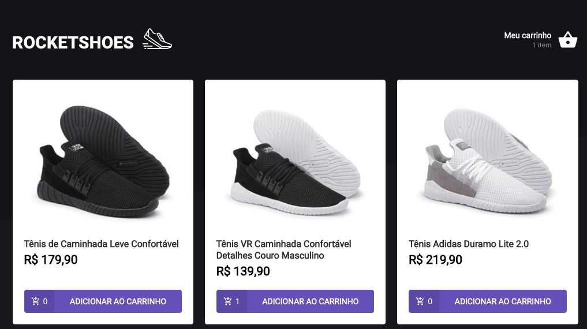

Projeto criado para o módulo 2 da rocketseat, Criando um hook de carrinho de compras

Projeto criado para fazer um hook de carrinho de compras e praticar algumas funcionalidades

## Configuraçõs Iniciais

Clonar o repositório e rodar "yarn" para instalar as dependências do projeto

Após isso, startar o JSON Server com "yarn server"

## Scripts disponíveis

Para rodar o projeto basta executar

### `yarn`

Para rodar o JSON server

### `yarn server`

Para instalar todas as dependências de pacotes do NPM

### `yarn start`

Roda a aplicação em modo de desenvolvimento. 
Abra [http://localhost:3000](http://localhost:3000) para ver o projeto no browser.

### `yarn test`

Para executar os testes necessários para a aplicação ser considerada criada com sucesso

## Fundamentos

Neste projeto foram colocados em prática os conhecimentos adquiridos no módulo 2 do curso de React, tais como:

- Axios;
- Typescript;
- Hooks;
- Promises;
- Local Storage;
